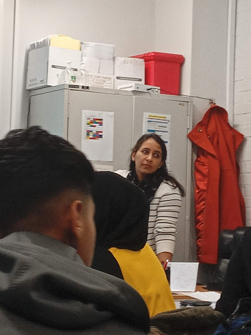

# treesprite.ml
A Personal Portfolio [Client Work]

## How to use github to edit the website
Unlike the old website this website does not use a CMS (content management system) so there is not admin page as this website is written in pure html and css to improve performence and can be used as a platform if you do so wish to learn the basics of web development

### Using Github to edit the source code
Github is a gui for something known as GIT it manages the content and makes sure that the repo is running the latest set of files. To edit the website:

### STEP 1: Create an github account

[Create github account](URL "https://github.com/signup?ref_cta=Sign+up&ref_loc=header+logged+out&ref_page=%2F&source=header-home")

### STEP 2: Editing the repo

    Editing index.html

### STEP: 3 coding in HTML

HTML may look dauting at first but its actually very simple the basics are that < h1>
tags are for headers and < p> are for smaller texts a great help for starting out using HTML and CSS is [W3Schools](URL "https://www.w3schools.com") and just search for something you want to add maybe change the backround colour or add pictures...

### Step: 4 Submitting the code to the repo

As said before github uses git to manage the code...

    Publishing the code:

    Give ur changes a good name and describe what you have done...

IN A FEW SECONDS THE WEBSITE WILL BE USING THE LATEST GIT COMMIT AND THE WEBSITE HAS BEEN EDITED well done.

## Adding media to the website:
Videos, pictures and audio:

Commit the changes

    head over now to the index.html page and edit it shown above:

    GO TO LINE 109 here is were the tags that we need to edit are

     
        
    ect
### change the "images/work_NUMBER.jpg" to "NAME OF THE IMAGE"

commit changes 

view website for changes

## I REALLY DONT LIKE USING THE WEB GUI IF YOU WANT TO PLEASE USE A IDE TO MAKE CHANGES TO THE WEBSITE IE VSCODE OR ATOM IT WILL MAKE THE PROCESS SO MUCH EASIER AND LESS HASSLE TRYING TO EDIT IT USING THE WEB GUI. THEN JUST UPLOAD THE THE CHANGES TO GIHUB!!!

.
.
# Links

[VScode Download](URL "https://code.visualstudio.com/")

[A Great Tutorial On Git vscode on WINDOWS](URL "https://github.com/sailesh307/GitHubTutorial")

:) Thanks

the Ned